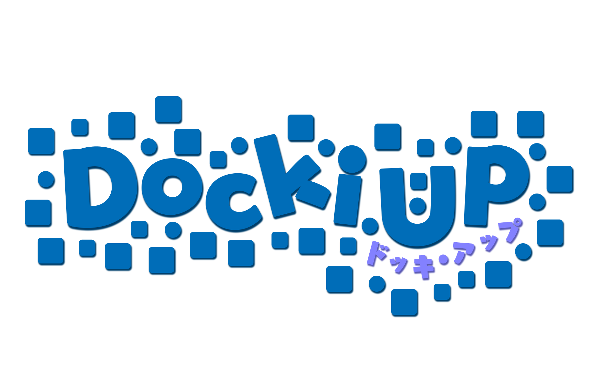
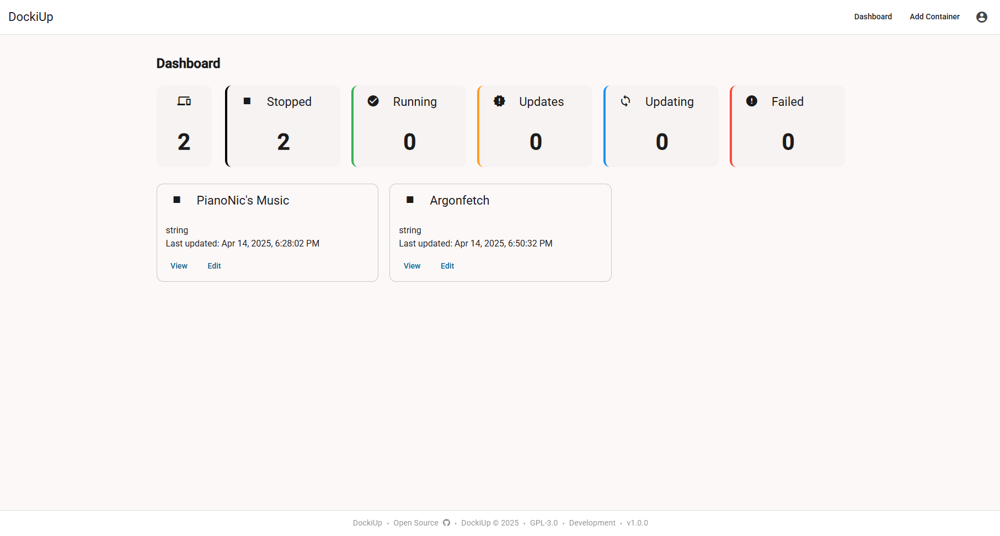

    

    <strong>DockiUp</strong> - Git-based Docker container deployment automation

    You commit, we pull, build, and deploy.

    
    
    
    

---

> **⚠️ Important Note:** This project is currently under development and may not function as described directly from the main branch. For a working version, please check the [Releases tab](https://github.com/Pianonic/DockiUp/releases) for the latest stable release.

## 🚀 What is DockiUp?

DockiUp monitors your Git repositories for changes, then automatically:
1. Pulls the latest changes from your specified branch
2. Rebuilds your Docker containers with the updated code
3. Deploys the new containers with minimal downtime

Perfect for developers who want a simple CI/CD pipeline for their personal projects.

## 🖼️ Screenshots

    

## ✨ Features

- **Automatic Monitoring**: Checks for Git repository changes at customizable intervals
- **Manual Trigger**: Force updates on demand via the intuitive web interface
- **Multi-Repository Support**: Manage multiple projects from a single dashboard
- **Flexible Configuration**:
  - Set custom check intervals (from 5 minutes to daily)
  - Specify which Git branch to monitor
  - Configure rebuild parameters
- **Authentication Support**: Works with both public and private Git repositories

## 🔧 How It Works

DockiUp runs as a service that:
1. Monitors your specified Git repositories for new commits
2. When changes are detected, pulls the latest code
3. Rebuilds Docker containers based on the updated code
4. Restarts the containers with your specified configuration

## 📋 Getting Started

1. **Installation**: Check the [Releases tab](https://github.com/Pianonic/DockiUp/releases) for installation instructions and assets. General documentation can be found here: [Documentation](docs/docs.md)
2. **Configuration**: Add your Git repositories and Docker settings
3. **Monitor**: Watch your containers stay up-to-date automatically

## 💻 Technical Details

- DockiUp requires access to the Docker socket to manage containers
- Runs as a Docker container
- Supports webhook integration for instant updates

## 📜 License

This project is licensed under the GPL-3.0 License.
See the [LICENSE](LICENSE) file for details.

---

Made with ❤️ by <a href="https://github.com/Pianonic">PianoNic</a>

