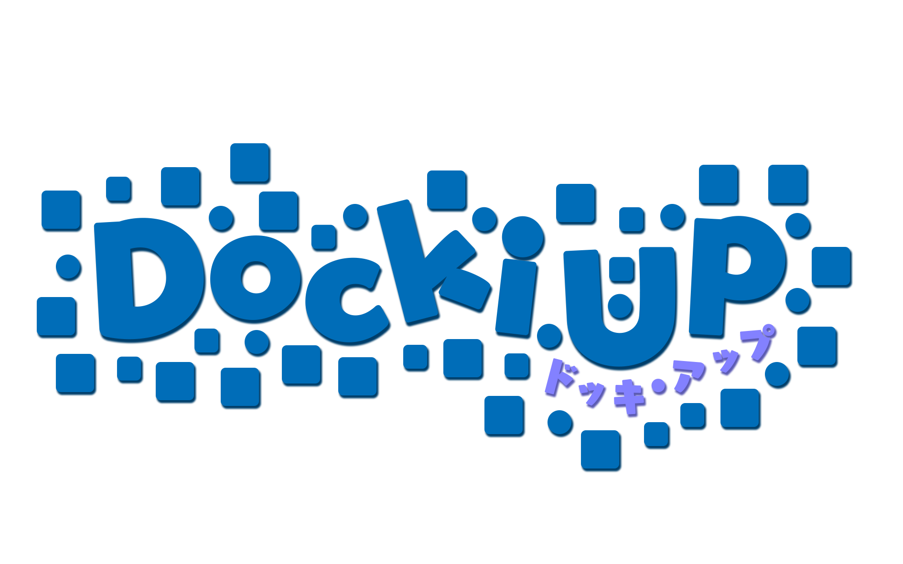
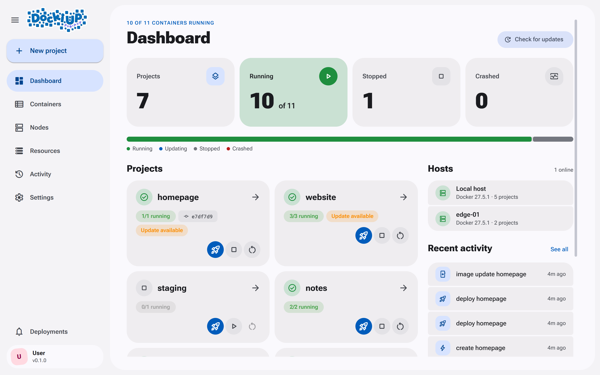
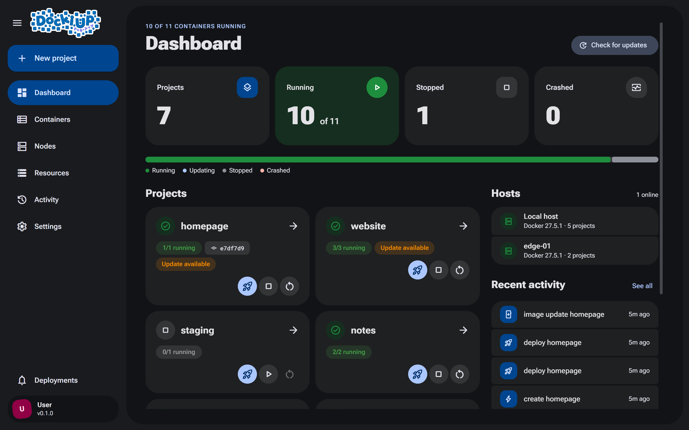
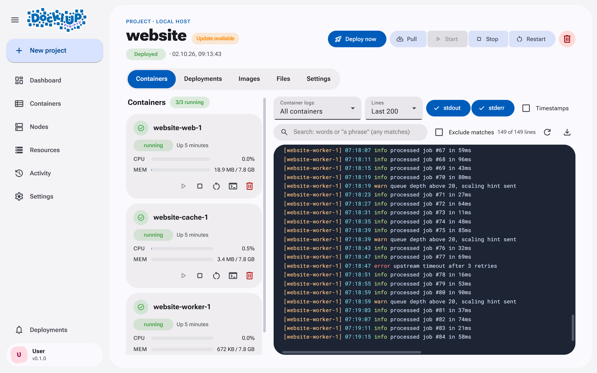
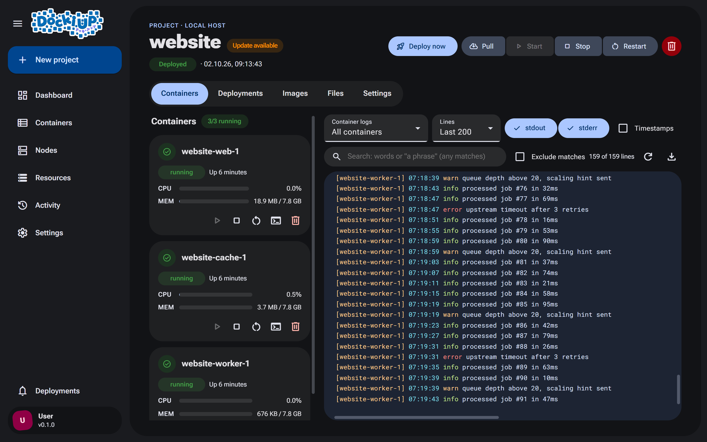
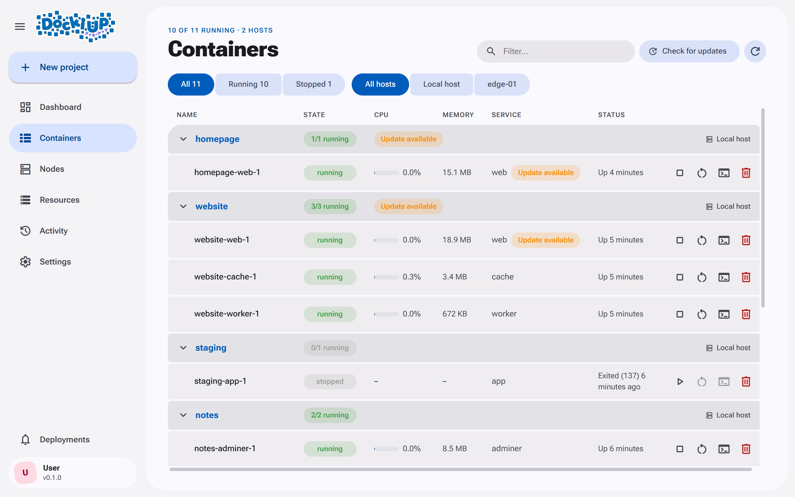
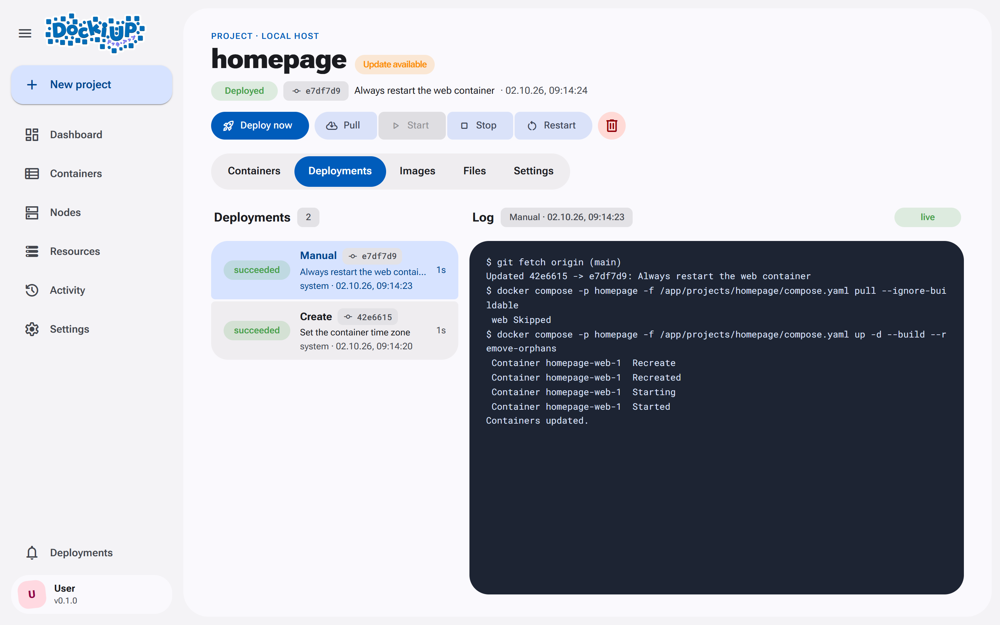
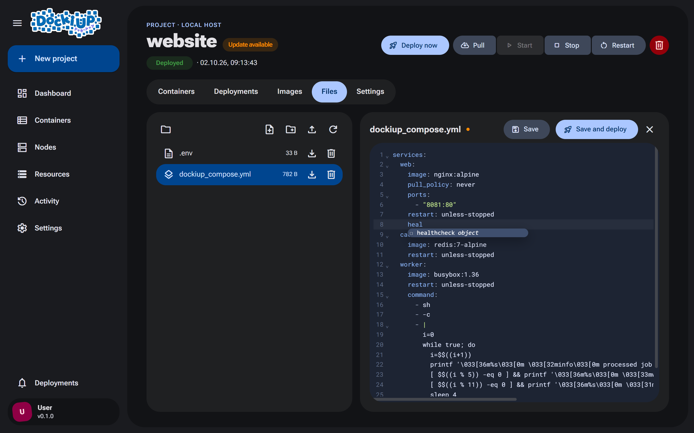
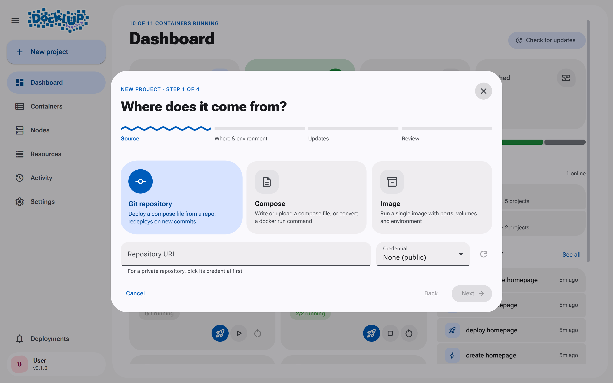
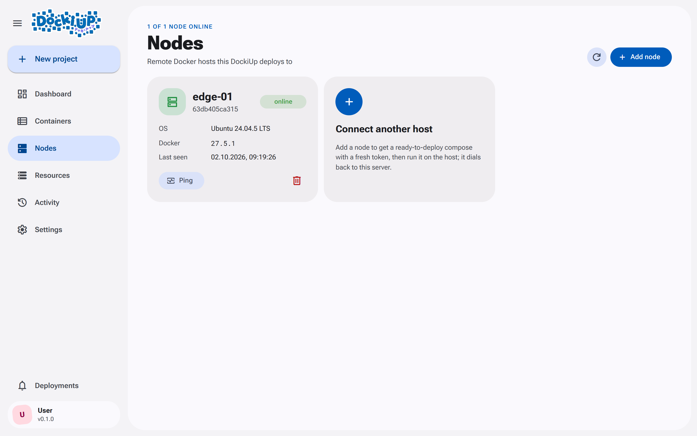

<p align="center">
  
</p>

<p align="center">
  <strong>Self-hosted Docker Compose deployments: you commit, DockiUp pulls, builds and deploys.</strong>
</p>

<p align="center">
  <a href="https://github.com/PianoNic/DockiUp"></a>
  <a href="https://github.com/PianoNic/DockiUp/releases"></a>
  <a href="LICENSE.md"></a>
  <a href="https://docs.dockiup.pianonic.ch/getting-started"></a>
  <a href="https://docs.dockiup.pianonic.ch/development"></a>
</p>

---

## Screenshots

<p align="center">
  
  
</p>
<p align="center">
  
  
</p>

<details>
<summary><strong>More screenshots</strong></summary>

<p align="center">
  
  
</p>
<p align="center">
  
  
</p>
<p align="center">
  
</p>

</details>

## Features

- **Deploy from anywhere**: a Git repository (public or private), a compose file you write or upload, a
  single image, or a pasted `docker run` command.
- **Updates on your terms**: push webhooks from GitHub, Gitea/Forgejo and GitLab, a schedule, or a button.
  Every deployment is queued and kept with its commit and full log.
- **Existing stacks, no migration**: compose projects already running on a host are picked up
  automatically, in place. Nothing is moved, copied or restarted.
- **Several hosts**: add a node with one compose file. It dials back to DockiUp, so the node needs no
  open ports.
- **Image updates**: newer images for the tags you run are detected; get notified or deploy them
  automatically, and pin a service to another tag.
- **Files in the browser**: edit compose and config files with completion, hover help and checks from the
  official compose schema. In Git projects, saving commits and pushes.
- **Logs and terminal**: coloured logs with search and local timestamps, a shell into any container, and
  live CPU and memory.
- **Secrets**: an encrypted vault whose values reach compose through an env file and never appear in
  logs.
- **Notifications**: Discord, Slack, Telegram, ntfy or any webhook, for deployments, nodes, image updates
  and cleanups.
- **Housekeeping**: images, volumes and networks per host, pruning, and scheduled cleanup.
- **Optional sign-in**: any OpenID Connect provider, or none.

## Quick start

```bash
mkdir dockiup && cd dockiup
curl -O https://raw.githubusercontent.com/PianoNic/DockiUp/main/compose.yml
curl -o .env https://raw.githubusercontent.com/PianoNic/DockiUp/main/.env.example
```

Set `POSTGRES_PASSWORD` and `VAULT_MASTER_KEY` in `.env` (create the key with `openssl rand -base64 32`), then:

```bash
docker compose up -d
```

Open <http://localhost:8080>.

## Documentation

**[docs.dockiup.pianonic.ch](https://docs.dockiup.pianonic.ch)**

- [Getting started](https://docs.dockiup.pianonic.ch/getting-started)
- [Existing stacks](https://docs.dockiup.pianonic.ch/existing-stacks)
- [More hosts](https://docs.dockiup.pianonic.ch/nodes)
- [Development](https://docs.dockiup.pianonic.ch/development)

## Licence

[PolyForm Noncommercial 1.0.0](LICENSE.md).
